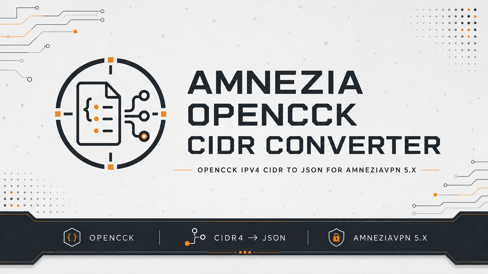

# Amnezia OpenCCK CIDR Converter

[](https://github.com/yaleksandr89/amnezia-opencck-cidr-converter/actions/workflows/ci.yml)
[](../../LICENSE)

<p align="center">
  
</p>

## Choose a language

| Русский | English | Español | 中文 | Français | Deutsch |
|---|---|---|---|---|---|
| [Русский](../../README.md) | **Selected** | [Español](./README_es.md) | [中文](./README_zh.md) | [Français](./README_fr.md) | [Deutsch](./README_de.md) |

Converts OpenCCK IPv4 CIDR lists to JSON that can be imported correctly into AmneziaVPN 5.x.

The project does not modify or patch the client. It transforms the list before import.

> [!IMPORTANT]
> This is a temporary workaround for a CIDR import issue, not an official AmneziaVPN format. The project is not affiliated with the AmneziaVPN or OpenCCK teams.

## Problem

OpenCCK may return a CIDR value in the `hostname` field:

```json
{
  "hostname": "142.250.0.0/15",
  "ip": ""
}
```

During a problematic import, the subnet prefix may be lost. The converter creates an entry where the CIDR is stored in `ip`:

```json
{
  "hostname": "route-000001.invalid",
  "ip": "142.250.0.0/15"
}
```

## What the converter does

- accepts a URL generated at `iplist.opencck.org`;
- validates and converts valid IPv4 CIDR entries;
- removes duplicates while preserving the original order;
- creates `amnezia-opencck-cidr.json` in the project root, ready for import.

## Supported systems

| System | Launcher | Requirements |
|---|---|---|
| Windows 10/11 | `bin/convert-opencck-cidr.cmd` | Windows PowerShell 5.1 or PowerShell 7 |
| macOS | `bin/convert-opencck-cidr.sh` | Bash and either `curl` or `wget` |
| Linux | `bin/convert-opencck-cidr.sh` | Bash and either `curl` or `wget` |

## Quick start

### 1. Prepare the OpenCCK URL

1. Open [iplist.opencck.org](https://iplist.opencck.org/).
2. Select the required sites and services.
3. Choose the **Amnezia** format.
4. Choose **IPv4 CIDR ranges**.
5. Disable **Save as file**.
6. Copy the long URL from the field at the bottom of the page.

### 2. Run the converter

#### Windows

Double-click:

```text
bin/convert-opencck-cidr.cmd
```

#### macOS and Linux

Allow execution once:

```bash
chmod +x ./bin/convert-opencck-cidr.sh
```

Run:

```bash
./bin/convert-opencck-cidr.sh
```

The interface language is detected automatically and can be overridden during parameterized execution.

Import the generated JSON into the application after the converter finishes.

Parameters, language selection, direct source execution, project structure, and tests are described in the [advanced usage guide](../guides/advanced-usage_en.md).

## Limitations

- Only IPv4 CIDR (`data=cidr4`) is supported.
- Network downloads accept only HTTPS URLs from `iplist.opencck.org`.
- Network mode depends on OpenCCK availability and response format.
- The converter may no longer be needed after the import issue is fixed in the official client.

## Feedback

- reproducible bugs — [GitHub Issues](https://github.com/yaleksandr89/amnezia-opencck-cidr-converter/issues);
- questions and ideas — [GitHub Discussions](https://github.com/yaleksandr89/amnezia-opencck-cidr-converter/discussions).

---

<p align="center">
  If this tool helped, consider starring the repository so other developers can find it. 🤘
</p>
